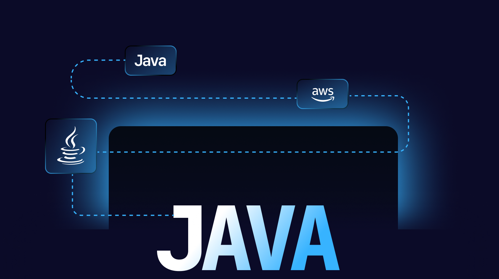

<p align="center">
    
</p>

<h1 align="center">Encurtador de URL</h1>
<p align="center">
   <em>Simplifique links com AWS S3, Lambda, e muito mais!</em>
</p>

<p align="center">
    
    
    
</p>


## Visão Geral

Esse projeto trata-se de um **sistema de encurtamento de URL's** utilizando a **AWS** como infraestrutura serverless. O principal objetivo é permitir que usuários criem URL's curtas que redirecionem para as URL's Originais, com um tempo de expiração configurável. o sistema é composto por duas funções Lambda:

1 - A primeira função é responsável por gerar e armazenar os links encurtados em um bucket no s3, junto com as informações das url's originais e o tempo de expiração.

2 - A segunda função gerencia o redirecionamento, verificando o código da URL curta e validando se a URL ainda está dentro do prazo de expiração antes de redirecionar o usuário para a URL original.

## Ferramentas Utilizadas

|       | Ferramentas        | Descrição    |
| :---  | :---:              | :---          |
|   🧷  | **Lambda**         | O AWS Lambda é um serviço de computação sem servidor da Amazon Web Services (AWS) que permite executar código sem a necessidade de provisionar ou gerenciar servidores    |
|   🧷  | **S3**            | O Amazon S3 (Simple Storage Service) é um serviço de armazenamento de objetos oferecido pela Amazon Web Services (AWS). Ele é projetado para armazenar e recuperar qualquer quantidade de dados a qualquer momento, de qualquer lugar na web   |
|   🧷  | **Api Gateway**            | O Amazon API Gateway é um serviço gerenciado que facilita a criação, publicação, manutenção, monitoramento e segurança de APIs em qualquer escala. Ele permite que você crie APIs RESTful e WebSocket para permitir que aplicações se comuniquem de maneira segura e eficiente com backend services, como AWS Lambda, Amazon EC2, ou outros serviços web  |

## Estrutura do projeto

```sh
.
├── createurllambda
│   ├── pom.xml
│   └── src
│       ├── main
│       │   ├── java
│       │   │   └── org
│       │   │       └── example
│       │   │           ├── Main.java
│       │   │           └── UrlData.java
│       │   └── resources
│       └── test
│           └── java
└── redirecturlshortener
    ├── pom.xml
    └── src
        ├── main
        │   ├── java
        │   │   └── org
        │   │       └── diego
        │   │           ├── Main.java
        │   │           └── UrlData.java
        │   └── resources
        └── test
            └── java

19 directories, 6 files

```

## Usabilidade do Projeto

- **Trocar o nome do bucket dos arquivos pelo nome do seu bucket no S3:**

```java
.bucket("seu-bucket")
```

- **Comando para gerar arquvo '.jar' e adicionar no AWS Lambda:**

```bash
mvn clean package
```
## Aulas:

- **Aula 1** - Criando Funções Serverless e Configurando URl Encurtada
- **Aula 2** - Integração com S3
- **Aula 3** - Redirecionamento de URLs e Configuração do Api Gateway